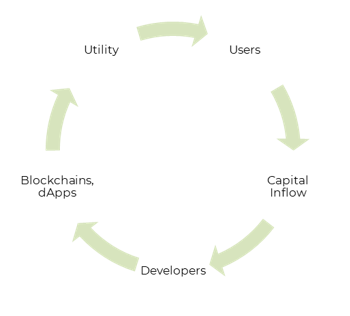

# Key Trends in Blockchain and DeFI

The growth story of Decentralized Finance (DeFi) and the multi-chain ecosystem has been staggering. With the continued adoption of WEB3 and the blockchain ecosystem, the reinforcing network flywheel effect will play a critical role to onboard new users, enterprises, and developers into this vibrant ecosystem.

